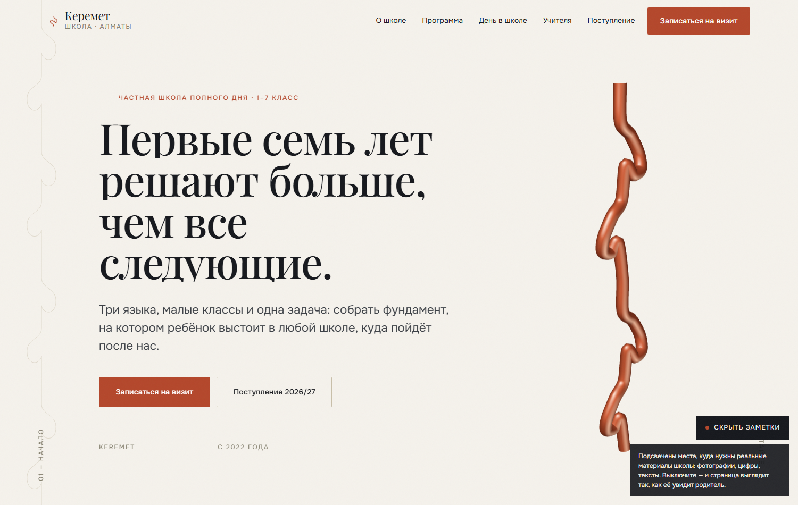

# KEREMET — концепт сайта школы

Демонстрационный концепт сайта школы «Керемет» (1–7 класс, Казахстан). Все
данные вымышлены. Построен на выводах исследования ~120 школьных сайтов
мира, СНГ и Казахстана.

**Живой сайт: https://daulet-rama.github.io/keremet-school/**

```bash
npm install
npm run dev      # http://localhost:3000/ru
npm run build    # статический экспорт в out/
```



---

## Деплой

GitHub Pages, сборка через Actions — `.github/workflows/deploy.yml`.
Пуш в `main` пересобирает и публикует автоматически.

Pages отдаёт только статику, поэтому проект собирается с `output: "export"`.
Три следствия, каждое из которых ломает сайт, если о нём забыть:

1. **`basePath: "/keremet-school"`.** Проектная страница живёт не в корне
   домена. Без префикса все ассеты возвращают 404. Включается переменной
   `GITHUB_PAGES=true`, чтобы `npm run dev` продолжал работать по корню.
   Внутренние ссылки обязаны идти через `next/link` — обычный `<a href="/ru">`
   префикс не получит и уедет в корень домена.
2. **`out/.nojekyll`.** Без него Pages прогоняет вывод через Jekyll, а тот
   игнорирует каталоги на подчёркивании — весь `/_next/` не публикуется,
   и сайт приезжает без стилей и скриптов. Самая частая причина «залил на
   Pages, а всё сломалось». Создаётся в `scripts/postbuild.mjs`.
3. **Middleware не существует в экспорте.** Редирект корня на `/ru/` раньше
   делал `src/proxy.ts`; теперь его пишет тот же postbuild в `out/index.html`
   тремя уровнями: meta refresh, скрипт и видимая ссылка на случай, если не
   отработало ни то, ни другое.

---

## Что здесь принципиального

### 1. Шрифты собраны из апстрима, а не с CDN Google

Главная техническая находка исследования. Апстримный `PlayfairDisplay[wght].ttf`
из репозитория `google/fonts` содержит **659 глифов**, включая все девять
казахских букв в обоих регистрах. Тот же Playfair, отданный
`fonts.googleapis.com` с `subset=cyrillic,cyrillic-ext`, — **330 глифов, без
ә ғ қ ң ө ү һ**. Запрос вообще без параметра `subset` отдаёт латиницу и ничего
больше.

Ломается не гарнитура, ломается конвейер сабсеттинга. Поэтому оба файла
собраны локально одним проходом `pyftsubset`:

```
латиница + Latin Extended + полная кириллица + казахские ә ғ қ ң ө ұ ү һ і
+ казахская латиница 2021 (ğ İ ş ū) → один woff2 на гарнитуру
```

| | вес |
|---|---|
| `PlayfairDisplay-var.woff2` | 100 КБ |
| `Onest-var.woff2` | 77 КБ |
| **итого, три письменности** | **177 КБ** |

Для сравнения: `haileybury.kz` отдаёт 14 сырых `.TTF` общим весом 7,61 МБ.

Дробить на `latin` / `cyrillic` / `cyrillic-ext` нельзя — на казахском тексте
это даёт подгрузку двух файлов и мигание.

**Пересборка шрифтов** (если понадобится другой набор символов): скрипт
`pyftsubset` с диапазонами описан в истории проекта; исходники берутся из
`raw.githubusercontent.com/google/fonts/main/ofl/…`.

### 2. Трёхъязычие заложено с первого дня

Отгружен только русский, но каркас готов:

- маршрут `/[locale]`, `<html lang>` подставляется по языку;
- `hreflang` — **взаимные абсолютные ссылки с корректным субтегом `kk`**.
  Из всего исследованного рынка это делает правильно ровно один сайт; все
  остальные пишут `hreflang="kz"` — это код страны, язык называется `kk`,
  и Google молча выбрасывает такую аннотацию;
- языки попадают в выдачу **только когда для них готов словарь**. Это
  защищает от самого частого дефекта рынка — «переведённый URL при
  непереведённой странице»;
- нет автовыбора языка по локали браузера: в Казахстане телефон часто на
  английском, а читают по-русски.

**Добавить казахский:** создать `src/i18n/dictionaries/kk.json`,
раскомментировать строку в `get-dictionary.ts`, добавить `"kk"` в
`SHIPPED_LOCALES`. Вёрстку и шрифты трогать не нужно.

### 3. Движение — opt-in, а не отключаемое

Всё движение объявлено **внутри** `@media (prefers-reduced-motion: no-preference)`.
Базовое правило всегда содержит конечное состояние, поэтому отсутствие
анимации незаметно. Так делают оба победителя Awwwards 2026 в образовании.

| Приём | Библиотека | Где |
|---|---|---|
| Плавная прокрутка | Lenis 1.3 | маркетинговые секции, не формы |
| Раскрытие заголовков построчно | GSAP SplitText (`mask`, `autoSplit`) | один заголовок на секцию |
| Орнаментальная линия | GSAP DrawSVG + ScrollTrigger scrub | сквозная, левый рельс |
| Закреплённая секция | ScrollTrigger `pin` | одна на страницу — «Программа» |
| Появление блоков | нативный CSS `animation-timeline: view()` | вне основного потока, без JS |
| Переходы страниц | `@view-transition` | две строки CSS |

GSAP 3.15 бесплатен, включая SplitText и DrawSVG — ключ и приватный реестр
не нужны.

**Чего сознательно нет:** кастомного курсора, 3D-блоба в герое,
горизонтальной прокрутки вне закреплённой секции, ритма на каруселях.
Всё четыре — маркеры 2023 года.

### 4. Заглушки вместо фотографий

Реальных снимков нет, поэтому каждый слот несёт **описание нужного кадра,
соотношение сторон и разрешение**. Это одновременно ТЗ на съёмку.

Подстановка настоящего фото — замена содержимого компонента `Slot`
на `<Image>`; вёрстка, пропорции и анимации не трогаются.

Переключатель «Заметки» в правом нижнем углу скрывает все редакционные
пометки — страница выглядит так, как её увидит родитель.

---

## Структура

```
src/
  app/
    globals.css          токены, типографика, движение, заглушки
    sections.css         раскладка разделов
    [locale]/            layout (шрифты, метаданные) + page
  components/            секции; клиентские — только там, где нужен GSAP
  i18n/
    config.ts            языки, hreflang
    dictionaries/ru.json ВЕСЬ текст сайта
  fonts/                 два woff2
  lib/
    gsap.ts              регистрация плагинов
    ornament.ts          геометрия қошқар мүйіз
  (редирект корня генерируется scripts/postbuild.mjs)
scripts/
  shot.mjs               снимок страницы через CDP
  probe.mjs              опрос вычисленных стилей
  postbuild.mjs          редирект корня + .nojekyll для Pages
```

Весь текст живёт в `ru.json`. В компонентах строк нет.

---

## Что нужно от школы

1. **Фотографии** по списку в слотах. Главный блок — «Бір жыл»: одно окно,
   снятое двенадцать раз за год с одной точки. Двенадцать выездов по двадцать
   минут — самый дешёвый контент проекта и единственный, который конкурент
   не повторит.
2. **Рост по годам** — учебный год, охваченные классы, число учеников на
   конец года, плюс дата выгрузки. Дату не публикует никто на рынке, а без
   неё цифру нельзя проверить.

   Школе три года и она заканчивается седьмым классом, поэтому поступлений
   в вузы у неё нет — и подставлять их нельзя. Рост здесь честнее и сильнее:
   родитель читает его как «сюда идут и отсюда не уходят». Когда появится
   первый выпуск седьмых классов, этот же блок без изменения вёрстки
   превращается в «куда уходят выпускники» — меняется только содержимое
   `outcomes.ledger` в словаре.
3. **Стоимость обучения** по ступеням.
4. **Преподаватели** — имя, предмет, где учился, стаж, одна живая деталь.
5. **Человек в приёмной комиссии** — имя, портрет, номер WhatsApp, реальное
   число оставшихся мест.
6. **Адрес** и подключение CRM к форме визита.

---

## Замеры

Прод-сборка, страница `/ru`, gzip:

| | |
|---|---|
| HTML | 20,6 КБ |
| JS + CSS | 237 КБ |
| Шрифты | 177 КБ |
| **Первая загрузка** | **435 КБ** |

LCP — текстовый заголовок: ни картинки, ни видео в критическом пути.

---

## Оговорка

Полевых Core Web Vitals нет — цифры выше это статический анализ.
Перед продом снять реальные LCP/INP/CLS.

Юридический слой (закон РК №94-V, размещение данных) в этом концепте
не проработан — выведен за рамки задачи.
